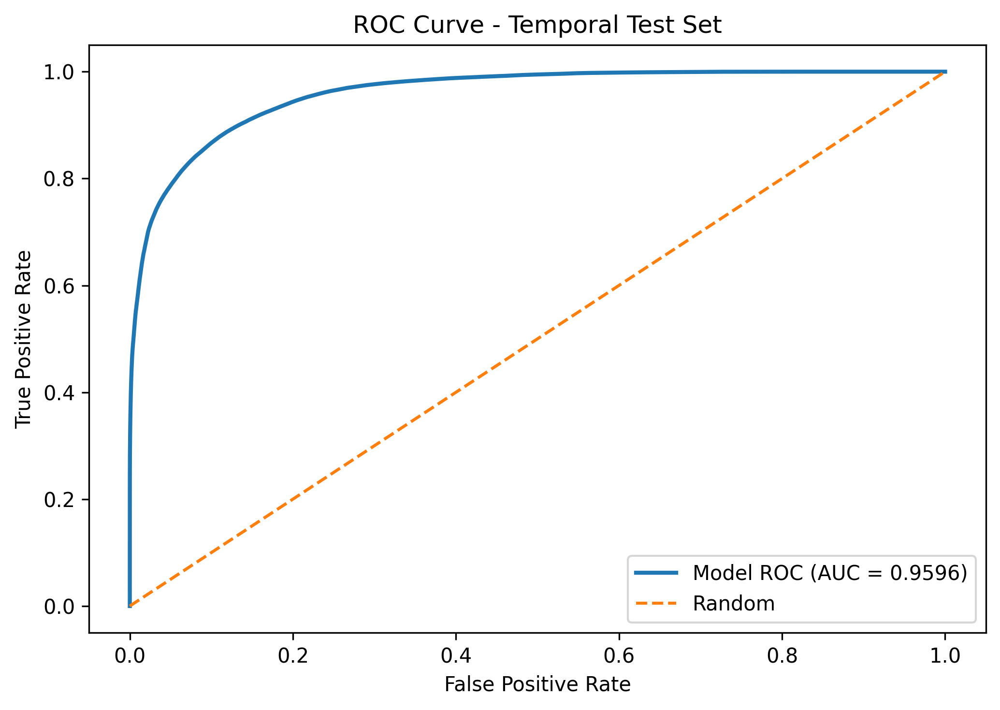
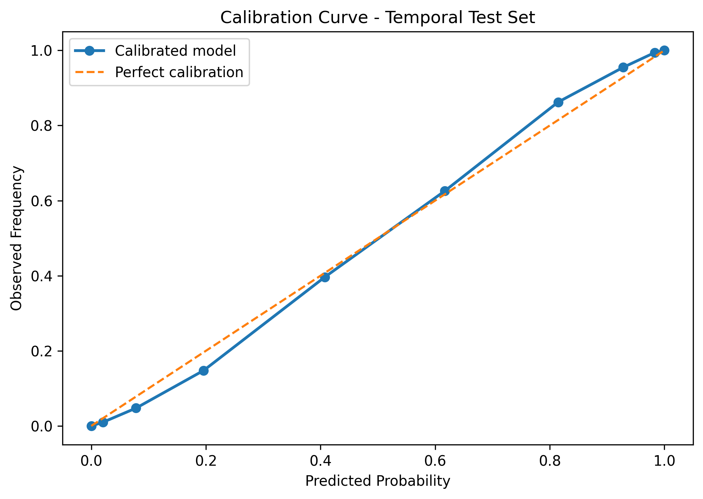
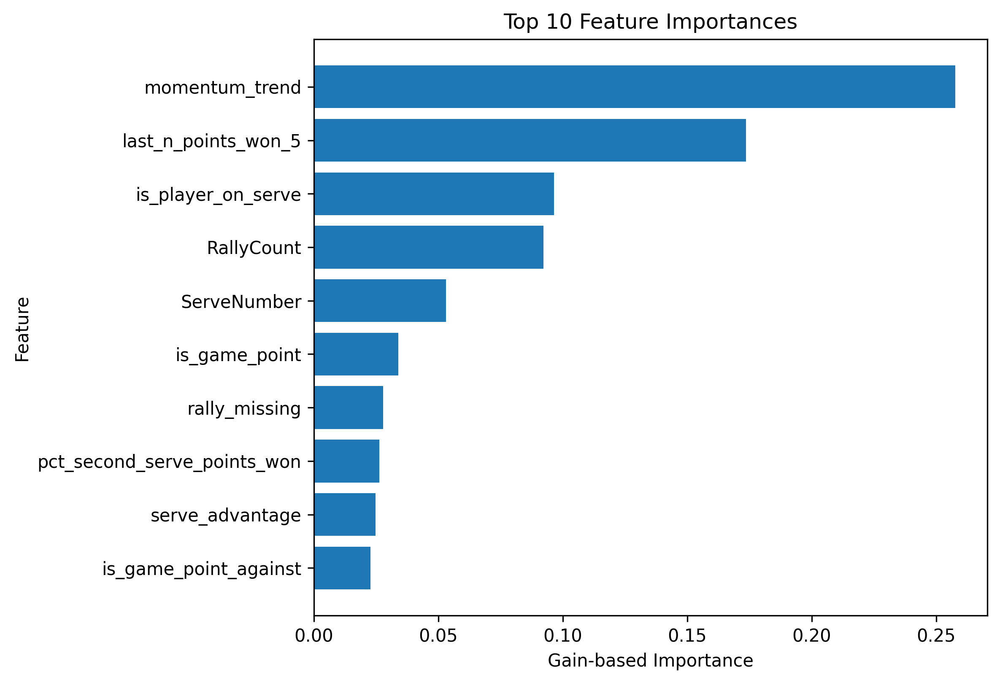

# TennisAI Pro — Manuale del Software
**Versione 2.0** · Giugno 2026

---

## Indice

1. [Panoramica del sistema](#1-panoramica-del-sistema)
2. [Landing Page — Selezione Modalità](#2-landing-page--selezione-modalità)
3. [Header della Dashboard](#3-header-della-dashboard)
4. [Live Match — Registrazione punto](#4-live-match--registrazione-punto)
5. [Live Match — Scoreboard e Hero](#5-live-match--scoreboard-e-hero)
6. [Live Match — Analisi Tattica](#6-live-match--analisi-tattica)
7. [Live Match — Schermata Corte (Court Mode)](#7-live-match--schermata-corte-court-mode)
8. [Archivio Match](#8-archivio-match)
9. [Infosys Demo — Analisi ATP](#9-infosys-demo--analisi-atp)
10. [AI Spinner Coach](#10-ai-spinner-coach)
11. [Outdoor Mode](#11-outdoor-mode)
12. [Export e Report](#12-export-e-report)
13. [Impostazioni Match](#13-impostazioni-match)
14. [Selettore Lingua IT/EN](#14-selettore-lingua-iten)
15. [Architettura del Modello AI](#15-architettura-del-modello-ai)
16. [Configurazione e Requisiti](#16-configurazione-e-requisiti)

---

## 1. Panoramica del sistema

TennisAI Pro è un'applicazione di analisi tattica in tempo reale per il tennis, progettata per coach e giocatori. Combina:

- **Motore predittivo XGBoost** calibrato isotonicamente per la probabilità di vittoria del punto
- **Classificatore tattico RF** a 8 pattern (RandomForest con `balanced_subsample`)
- **Scoring engine locale** per il tracciamento del punteggio completo (incluso tie-break)
- **Interfaccia React** ottimizzata per tablet da corte e desktop

**Stack tecnico:**
- Frontend: React 18 + Vite + TailwindCSS, impacchettato come APK Android con Capacitor 8
- Backend: FastAPI su Render (free tier), con warm-up automatico
- Modello AI: XGBoost + Isotonic Regression, 31 feature, train/test split temporale per match

---

## 2. Landing Page — Selezione Modalità

All'avvio dell'applicazione compare la landing page con tre card modalità.

```
┌──────────────────────────────────────────────┐
│  🎾 TennisAI Pro                             │
│                                              │
│  ┌──────────┐  ┌──────────┐  ┌──────────┐   │
│  │          │  │          │  │          │   │
│  │   LIVE   │  │ ARCHIVIO │  │  INFOSYS │   │
│  │  MATCH   │  │  MATCH   │  │   DEMO   │   │
│  │          │  │          │  │          │   │
│  └──────────┘  └──────────┘  └──────────┘   │
│                                              │
│  [Backend: Online ●]  [Avvia Backend]        │
└──────────────────────────────────────────────┘
```

> **[Schermata 1]** Landing page con le tre card modalità e il badge backend

### Elementi della Landing Page

| Elemento | Descrizione |
|---|---|
| **Card Live Match** | Accede al tracciamento live del match corrente con AI |
| **Card Archivio Match** | Sfoglia e analizza i match già registrati |
| **Card Infosys Demo** | Simulazione tattica pre-punto in stile ATP/Infosys |
| **Badge Backend** | Indica lo stato del server AI (Online / Checking / Offline) |
| **Pulsante "Avvia Backend"** | Visibile quando offline — esegue warm-up di Render |

### Badge Backend

- **● Online** (verde): il backend risponde correttamente, AI disponibile
- **◌ Checking** (ambra, pulsante): verifica in corso
- **● Offline** (rosso): backend non raggiungibile, funzionamento in modalità locale

Il backend Render si "addormenta" dopo 15 minuti di inattività. Il pulsante **"Avvia Backend"** esegue un warm-up e richiede fino a 60 secondi al primo avvio.

---

## 3. Header della Dashboard

L'header è fisso in cima a tutte le viste della dashboard.

```
┌─────────────────────────────────────────────────────────────┐
│ [🎾 TennisAI Pro Dashboard]  [Live Match][Archivio][Demo]   │
│                              [● Online] [IT] [☀] [tab: ▶]  │
└─────────────────────────────────────────────────────────────┘
```

> **[Schermata 2]** Header desktop con nav pills, backend badge, language toggle e outdoor mode

| Controllo | Funzione |
|---|---|
| **Logo TennisAI Pro** | Clic → torna alla Landing Page |
| **Nav pills** (desktop) | Cambio veloce tra Live / Archivio / Demo |
| **Badge Backend** | Mostra stato; clic → ricontrolla |
| **Selettore IT/EN** | Commuta lingua dell'intera interfaccia |
| **☀ Outdoor Mode** | Aumenta contrasto per uso all'aperto con luce solare |
| **Tab indicator** (mobile) | Mostra la tab attiva su schermi piccoli |

**Bottom Nav** (mobile/tablet):

```
┌──────────────────────────────────────┐
│  ●                                   │
│ [🎯 Live] [📋 Archivio] [🤖 Demo]   │
└──────────────────────────────────────┘
```

> **[Schermata 3]** Bottom navigation bar su tablet in modalità portrait

---

## 4. Live Match — Registrazione punto

### 4.1 Setup Match

Prima di iniziare, si compila il setup:

> **[Schermata 4]** Wizard setup match — selezione giocatore, avversario, superficie

| Campo | Opzioni |
|---|---|
| **Giocatore** | Seleziona da lista o crea nuovo (nome, mano, stile) |
| **Avversario** | Nome libero |
| **Torneo** | Nome libero |
| **Superficie** | Hard / Clay / Grass / Indoor Hard |
| **Formato** | BO3 / BO5 |
| **Primo servizio** | Tu / Avversario |
| **Round** | Libero (es. QF, SF, F) |

### 4.2 Fast Tag Panel

Il pannello centrale per registrare ogni punto in 3–5 tap:

> **[Schermata 5]** Fast Tag Panel — selezione vincitore + pattern tattico + tipo finale

```
┌──────────────────────────────────────────────┐
│ VINCITORE PUNTO                              │
│  [● TU]          [● AVVERSARIO]              │
│                                              │
│ PATTERN TATTICO                              │
│  [Servizio+1] [Risposta] [Scambio Corto]     │
│  [Scambio Medio] [Scambio Lungo] [Attacco]   │
│  [A Rete] [Difesa] [Passante]                │
│                                              │
│ TIPO FINALE                                  │
│  [Winner] [Errore non forzato] [Forzato]     │
│  [Ace] [Doppio fallo]                        │
│                                              │
│  [▶ REGISTRA PUNTO]   [↩ Annulla]            │
└──────────────────────────────────────────────┘
```

**Parametri avanzati** (espandibili):

| Parametro | Valori |
|---|---|
| Numero servizio | 1° / 2° / Ace |
| Direzione servizio | Largo / Corpo / T |
| Qualità servizio | Kick / Slice / Piatto |
| Tipo risposta | Aggressiva / Neutrale / Difensiva |
| Fase scambio | Corto / Medio / Lungo |
| Evento chiave | Nessuno / Vincente in corsa / Drop shot / Lob |
| Colpo finale | Dritto / Rovescio / Volée / Smash / Servizio |

> **[Schermata 6]** Fast Tag Panel con parametri avanzati espansi

### 4.3 Flusso di registrazione

1. Seleziona **vincitore** (Tu / Avversario)
2. Seleziona **pattern tattico** (macro pattern 9 classi)
3. Seleziona **tipo di finale** (Winner / Errore / Ace…)
4. *(Opzionale)* Espandi parametri avanzati
5. Premi **Registra Punto** → il sistema:
   - Aggiorna il punteggio (incluso tie-break automatico)
   - Invia i dati al backend AI per analisi tattica
   - Aggiorna l'Hero con nuova probabilità e consiglio tattico
   - Aggiunge il punto al log (Momentum Strip, Analytics Panel)

---

## 5. Live Match — Scoreboard e Hero

### 5.1 Scoreboard

```
┌─────────────────────────────────────────────────────────────┐
│  ● LIVE   Hard   BO3                                        │
│  Set 1 · Game 4 · Punto 12               [Impostazioni] [R]│
│                                                             │
│  ┌──────────────────────────────────────────────────────┐   │
│  │   TU (In Servizio)        VS        AVVERSARIO        │   │
│  │   Sinner                             Alcaraz          │   │
│  │   Set: 1    Game: 3    Punto: 40   |  Set: 0  Game: 2│   │
│  │   Point:   40                      |  Point:  30      │   │
│  └──────────────────────────────────────────────────────┘   │
│                                                             │
│  [Prob. Punto: 67%] [Confidenza: ALTA] [Momentum: IN VOLO] │
│  [Pressione: Break Point Contro]  [Punti Registrati: 11]   │
└─────────────────────────────────────────────────────────────┘
```

> **[Schermata 7]** Scoreboard completo in condizioni di break point

**Punteggio Tie-break**: quando entrambi i giocatori raggiungono 6 giochi, il sistema passa automaticamente al conteggio numerico del tie-break (0, 1, 2 … 7+) con regola dei 2 punti di scarto.

### 5.2 Stats Bar

| Cella | Contenuto |
|---|---|
| **Prob. Punto** | Probabilità % stimata dal modello XGBoost |
| **Confidenza** | ALTA / MEDIA / BASSA — intervallo di confidenza del modello |
| **Momentum** | IN VOLO (HOT) / IN CALO (COLD) / NEUTRO |
| **Pressione** | Break Point / Game Point / Match Point / Deuce / Neutro |
| **Punti Registrati** | Numero totale di punti nel dataset live corrente |

### 5.3 Tactical Insight Card

> **[Schermata 8]** Tactical Insight card con consiglio tattico AI

La card verde sotto lo scoreboard mostra il consiglio tattico generato dall'AI per il punto corrente. Esempio:

> *"Servizio largo e attacco in avanzamento — l'avversario è in posizione difensiva sul lato del rovescio"*

---

## 6. Live Match — Analisi Tattica

### 6.1 Analytics Panel

> **[Schermata 9]** LiveAnalyticsPanel con distribuzione pattern e statistiche

Il pannello analytics mostra in tempo reale:
- **Pattern Distribution**: grafico a barre con la frequenza dei 9 macro-pattern nel match
- **Win Rate per Pattern**: percentuale vittoria per ciascun pattern
- **Statistiche aggregate**: % punti in servizio, % punti in risposta, 1° servizio, 2° servizio

### 6.2 Momentum Strip

> **[Schermata 10]** Momentum Strip — sequenza visiva degli ultimi punti

La striscia orizzontale mostra gli ultimi punti:
- **Verde**: punto vinto
- **Rosso**: punto perso
- **Dimensione**: proporzionale alla swing di probabilità (variazione AI)
- **Tooltip**: hover/tap per vedere pattern tattico e dettagli del punto

### 6.3 Pattern Distribution Panel

> **[Schermata 11]** PatternDistributionPanel — distribuzione tattica completa

Grafico a torta o barre con la distribuzione di tutti i pattern tattici del match in corso. Permette di identificare rapidamente quale schema di gioco domina.

### 6.4 Recent Points Timeline

> **[Schermata 12]** Timeline degli ultimi punti con dettagli tattici

Lista scorrevole degli ultimi 20–30 punti con:
- Vincitore del punto
- Pattern tattico (label breve)
- Tipo di finale
- Variazione di probabilità (swing ±pp)

---

## 7. Live Match — Schermata Corte (Court Mode)

La modalità corte è ottimizzata per uso da bordo campo su tablet.

> **[Schermata 13]** Court Mode attiva — interfaccia semplificata per registrazione rapida

Si attiva premendo il pulsante **COURT** nell'area azioni del match.

```
┌──────────────────────────────────────┐
│          67%  ▌▌▌▌▌▌░░░             │
│    Sinner (In Servizio)  3-2 40-30  │
│                                      │
│    [● PUNTO MIO]  [● PUNTO AVVERS.]  │
│                                      │
│    [Servizio+1] [Risposta] [Scambio] │
│    [Winner] [Errore] [Ace]           │
│                                      │
│    [▶ REGISTRA]   [↩ ANNULLA]        │
└──────────────────────────────────────┘
```

**Caratteristiche Court Mode:**
- Bottoni più grandi (ottimizzati per touch con guanti o in movimento)
- Keep-awake attivo (schermo rimane acceso durante il match)
- Punteggio e probabilità sempre visibili in cima
- Feedback tattici ridotti al minimo per non distrarre

---

## 8. Archivio Match

> **[Schermata 14]** LiveArchivePage — lista match precedenti

La pagina Archivio mostra tutti i match salvati localmente sul dispositivo:

```
┌──────────────────────────────────────────────┐
│ ARCHIVIO MATCH                               │
│                                              │
│ ┌──────────────────────────────────────────┐ │
│ │ Sinner vs Alcaraz · Roland Garros · 2026 │ │
│ │ Clay · BO3 · 47 punti · 6-4 6-3         │ │
│ │ [Apri] [Export CSV] [Export JSON]        │ │
│ └──────────────────────────────────────────┘ │
│ ┌──────────────────────────────────────────┐ │
│ │ Tu vs Rossi · Circolo Tennis · 2026      │ │
│ │ Hard · BO3 · 23 punti · 6-7 3-6         │ │
│ │ [Apri] [Export CSV] [Export JSON]        │ │
│ └──────────────────────────────────────────┘ │
└──────────────────────────────────────────────┘
```

Per ogni match sono disponibili:
- Tutti i punti registrati con parametri tattici
- Riepilogo statistiche (% vincite, pattern dominanti)
- Export in formato CSV o JSON per analisi esterne

---

## 9. Infosys Demo — Analisi ATP

La pagina Infosys Demo riproduce l'esperienza dell'analisi tattica pre-punto in stile ATP/Infosys.

> **[Schermata 15]** InfosysDemoPage — setup iniziale con preselezione scenario

### 9.1 Setup Scenario

Wizard per configurare lo scenario (giocatori, superficie, punteggio, servizio, statistiche):

> **[Schermata 16]** Wizard Setup con form e preset disponibili

**Preset disponibili:** Sinner vs Alcaraz (Roland Garros), Djokovic vs Federer (Wimbledon), e altri scenari storici.

### 9.2 Vista Live

> **[Schermata 17]** Infosys Demo in modalità Live — scoreboard TV style + predizione

```
┌──────────────────────────────────────────────────────┐
│ Infosys · ATP Tour   [● Backend online] [● Live Mode]│
│                                                      │
│  Sinner  ● 1  3  40    [Edit setup] [Fan/Coach]      │
│  Alcaraz    0  2  30                                 │
│                                                      │
│         72%                                          │
│   ████████████░░░░ Probabilità punto                │
│   [HIGH] [🔥 HOT] [GAME POINT FOR]                  │
│                                                      │
│  Servizio Aggressivo                                 │
│  "Servizio piatto largo nel primo set — ..."         │
│  [RISK: LOW]  [PRIORITY: EXPLOIT]                    │
└──────────────────────────────────────────────────────┘
```

### 9.3 Modalità Output

Il pannello di destra permette di scegliere la modalità di visualizzazione:

| Modalità | Audience | Contenuto |
|---|---|---|
| **Tifoso** | Fan | Descrizione semplice e coinvolgente del momento tattico |
| **Coach** | Allenatori | Analisi tecnica dettagliata con indicazioni specifiche |
| **Media** | Giornalisti | Testo pronto per articoli e commenti broadcast |
| **API** | Sviluppatori | Payload JSON grezzo dell'API per integrazioni |

> **[Schermata 18]** Pannello Output Mode con le quattro modalità

### 9.4 Statistiche Match ATP-style

> **[Schermata 19]** Statistiche ATP-style con barre bicolore

Visualizzazione delle statistiche in stile broadcast ATP:
- Punti Vinti (con barra proporzionale)
- Winners
- Errori Non Forzati
- % Punti Servizio Vinti
- Punti di Scambio Lungo

### 9.5 Point History Feed

> **[Schermata 20]** Point history — feed laterale degli ultimi punti

Feed verticale degli ultimi 30 punti con:
- W/L (Won/Lost) colorato
- Numero punto
- Swing di probabilità (±pp)
- Tipo di finale e lunghezza scambio

### 9.6 Quick Tag Bar (Coach Mode)

> **[Schermata 21]** Quick Tag Bar in fondo allo schermo — registrazione veloce

La barra fissa in fondo permette di taggare ogni punto con un singolo tap:
- **W** (Winner) / **UE** (Errore non forzato) / **FE** (Forzato) / **Ace** / **DF** (Doppio fallo)
- Lunghezza scambio: Corto / Medio / Lungo
- Pulsante **Undo** per correggere l'ultimo punto

---

## 10. AI Spinner Coach

Lo Spinner AI Coach è un assistente contestuale disponibile su tutte le tab (tranne Live Match).

> **[Schermata 22]** SpinnerPanel aperto su tablet — conversazione con l'AI Coach

**Come accedervi:**
- Premere il pulsante FAB rotante **⚙** (in basso a destra)
- In Live Match: pulsante dedicato nel gruppo azioni corte

**Cosa può fare:**
- Rispondere a domande tattiche sul match in corso
- Suggerire aggiustamenti strategici basati sui dati registrati
- Spiegare le predizioni del modello in linguaggio naturale
- Analizzare i pattern dominanti del match

Lo Spinner usa il modello Claude Sonnet (Anthropic) via API e ha accesso al contesto del match corrente.

---

## 11. Outdoor Mode

> **[Schermata 23]** Confronto Normal Mode vs Outdoor Mode (contrasto aumentato)

La modalità outdoor aumenta contrasto e luminosità per utilizzo al sole.

**Attivazione:** Pulsante ☀ nell'header (sempre visibile)

**Effetti:**
- Sfondo più chiaro (grigio invece di nero profondo)
- Testo più scuro e leggibile
- Badge e pill con bordi più spessi
- Preferenza salvata in localStorage (persiste al riavvio)

---

## 12. Export e Report

### 12.1 Export CSV

> **[Schermata 24]** Dialog di export CSV con anteprima colonne

Il CSV esporta tutte le colonne necessarie per analisi esterne:

| Blocco colonne | Contenuto |
|---|---|
| **Identificatori** | match_id, SetNo, GameNo, PointNumber |
| **Contesto punto** | is_player_on_serve, ServeNumber, serve_direction, serve_quality |
| **Pattern** | macro_pattern, return_type, rally_phase, key_event, finish_type, finish_shot |
| **Statistiche cumulative** | pct_service_points_won, pct_return_points_won, last_n_points_won_5 |
| **Flags di pressione** | is_game_point, is_break_point, is_game_point_against |
| **Output AI** | predicted_point_win_probability, pattern_fused_id, pattern_fused_name |
| **Tattica** | tactical_call, tactical_explanation, risk_level, strategic_priority |
| **Zone** | dominant_zone, vulnerability_zone, recommended_intent |
| **Meta** | player_name, opponent_name, tournament, surface, match_type, round |
| **Punteggio** | set/game/point score, timestamp |

**Totale: 53 colonne** — compatibile con pandas, Excel, R.

### 12.2 Report PDF

Il report PDF include:
- Riepilogo match (giocatori, torneo, superficie, risultato)
- Statistiche aggregate (servizio, risposta, pattern)
- Lista punti con predizioni AI

### 12.3 Export JSON (Infosys Demo)

Disponibile nella pagina Infosys Demo per ogni sessione con dati di match completi in formato strutturato.

---

## 13. Impostazioni Match

> **[Schermata 25]** ScoreEditModal — correzione punteggio manuale

Il pulsante **Impostazioni Match** (header della vista Live) apre il pannello di configurazione.

**Funzioni disponibili:**
- **Correggi Punteggio**: modifica manualmente set, game, punto corrente
- **Reset Match**: azzera tutta la sessione corrente
- **Cambio servizio**: corregge chi serve

### 13.1 Correzione Score

La modale di correzione punteggio (pulsante ✏ arancione accanto ai counter Set/Game/Punto) permette di impostare manualmente:
- Set score (Tu / Avversario)
- Game score nel set corrente
- Punto corrente (0 / 15 / 30 / 40 / Ad)

### 13.2 Undo Ultimo Punto

Il pulsante **↩ Annulla** ripristina l'ultimo punto registrato (incluso punteggio, tag e parametri avanzati).

---

## 14. Selettore Lingua IT/EN

> **[Schermata 26]** Header con pulsante lingua attivo in EN

Il pulsante **IT** / **EN** nell'header commuta tutta l'interfaccia:

| Elemento | IT | EN |
|---|---|---|
| Nav | Live Match / Archivio Match / Infosys Demo | Live Match / Match Archive / Infosys Demo |
| Scoreboard | Giocatore / Avversario / In Servizio | Player / Opponent / Serving |
| Stats bar | Prob. Punto / Confidenza / Momentum / Pressione | Point Win / Confidence / Momentum / Pressure |
| Confidence | ALTA / MEDIA / BASSA | HIGH / MEDIUM / LOW |
| Momentum | IN VOLO / IN CALO / NEUTRO | HOT / COLD / NEUTRAL |
| Pressione | Break Point Favorevole/Contro / Deuce/Vantaggio | Break Point For/Against / Deuce / Advantage |
| Tattica | Consiglio Tattico / Analisi in tempo reale | Tactical Insight / Real-time coaching layer |
| Bottoni | Impostazioni Match / Reset Match / Annulla | Match Settings / Reset Match / Undo |

La scelta è persistita in `localStorage` (chiave `tennisai_lang`) e rimane attiva al successivo avvio.

---

## 15. Architettura del Modello AI

### 15.1 Feature Vector (31 dimensioni)

| Categoria | Feature |
|---|---|
| **Posizionali** | is_player_on_serve, serve_number, serve_direction, serve_quality, return_type, rally_phase, finish_type, finish_shot, key_event |
| **Dinamiche** | rally_bucket |
| **Cumulative** | pct_service_points_won, pct_return_points_won, pct_first_serve_points_won, pct_second_serve_points_won, last_n_points_won_5 |
| **Pressione** | is_game_point, is_break_point, is_game_point_against |
| **Derivate** | SPI (Serve Pressure Index), SA (Situational Advantage), FSG (First Serve Gap), momentum_trend |

### 15.2 Modelli

| Modello | Scopo | Metrica |
|---|---|---|
| **XGBoost** + Isotonic Regression | Probabilità vittoria punto | AUC 71.9%, Brier 0.212 |
| **RandomForest** 8-class (balanced_subsample) | Pattern tattico | 8 classi di schema |
| **Fusione regole-ML** | Pattern finale | Regole esplicite + output RF |

### 15.3 Validazione

- Train/test split **temporale per match_id** (non per riga) → nessun data leakage
- Test set: match interi mai visti durante il training
- Accuracy: **66.2%**, AUC: **71.9%**, Brier Score: **0.212**





---

## 16. Configurazione e Requisiti

### 16.1 Installazione Android (APK)

1. Connettere il tablet via USB e abilitare **Debug USB** nelle impostazioni sviluppatore
2. Eseguire: `adb install -r app-debug.apk`
3. L'app è disponibile nella lista applicazioni come **TennisAI Pro**

### 16.2 Variabili d'ambiente

| Variabile | Valore | Note |
|---|---|---|
| `VITE_API_BASE` | `https://tennisai-pro.onrender.com` | URL backend in produzione |
| — | `http://127.0.0.1:8000` | Fallback locale in development |

### 16.3 Backend (Render)

Il backend FastAPI è deployato su Render free tier:
- URL: `https://tennisai-pro.onrender.com`
- Warm-up automatico ogni 10 minuti (keepalive silenzioso)
- Endpoint principale: `POST /predict_point`
- Health check: `GET /health`

### 16.4 Storage locale

I dati sono salvati in `localStorage` del browser/WebView:

| Chiave | Contenuto |
|---|---|
| `tennisai_live_players` | Lista giocatori salvati |
| `tennisai_live_sessions` | Lista sessioni match |
| `tennisai_live_active_state` | Stato del match in corso |
| `tennisai_live_match_records` | Archivio completo tutti i match |
| `tennisai_outdoor` | Preferenza Outdoor Mode (0/1) |
| `tennisai_lang` | Lingua interfaccia ("it"/"en") |

---

## Note per la cattura degli screenshot

Per completare il manuale con screenshot reali, catturare le seguenti schermate dall'app in esecuzione su tablet:

1. Landing page (app appena aperta)
2. Header dashboard — tutte le varianti (online/offline, IT/EN)
3. Setup Match wizard
4. Fast Tag Panel — stato vuoto e stato compilato
5. Scoreboard durante un punto normale
6. Scoreboard con Break Point / Tie-break
7. Tactical Insight card con suggerimento AI
8. Analytics Panel e Momentum Strip
9. Court Mode attiva
10. Archivio Match con almeno 2 match
11. Infosys Demo — tutti e 4 gli output mode
12. Quick Tag Bar
13. Score Edit Modal
14. Outdoor Mode attiva/disattiva
15. Pulsante lingua IT/EN commutato

---

*Documento generato automaticamente — TennisAI Pro v2.0 · Giugno 2026*
