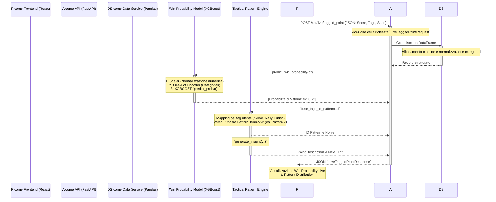

# Architettura del Modello TennisAI Pro

Questo documento illustra l'intero diagramma di flusso dei dati dal momento in cui l'utente clicca su "Registra punto" sul frontend, fino alla restituzione della predizione tattica da parte del backend in Python.

## 1. Diagramma di Flusso (Flowchart)



---

## 2. Le Fasi del Modello Analizzate nel Codice

Di seguito viene scomposto il processo analizzando singolarmente le fasi che permettono al modello di "ragionare".

### Fase 1: Creazione e Validazione del Payload (Frontend -> Backend)
Quando premi "Registra Punto", il frontend raccoglie tutti i dati (il punteggio, le tue selezioni "Serve", "Rally", "Finish" e calcola statistiche come la `% di prime in campo`).

**Descrizione:**
Questa fase assicura che il backend riceva un pacchetto dati tipizzato e strutturato secondo gli standard dell'API (tramite **Pydantic**).

**Codice del Modello (FastAPI `main.py`):**
```python
@app.post("/api/live/tagged_point", response_model=LiveTaggedPointResponse)
def handle_live_point(req: LiveTaggedPointRequest):
    # Passa i dati grezzi validati al servizio di analisi live
    return analyze_live_point(req)
```

---

### Fase 2: Costruzione del Vettore Lineare (Data Service)
Il modello Machine Learning non capisce oggetti JSON o dizionari annidati, ha bisogno di una riga di tabella (un vettore) con colonne uniformi al momento del suo allenamento.

**Descrizione:**
Il backend appiattisce il JSON ricevuto in un **Dataframe Pandas** ad una singola riga. Se il frontend omette un dato (es. `finish_shot` è null), il backend provvede ad assegnare il valore stringa vuoto o nullo corretto.

**Codice del Modello (`live_service.py`):**
```python
# Mappiamo esplicitamente le features come le aspetta il modello XGBoost
data = {
    "SetNo": req.set,
    "GameNo": req.game,
    ...
    "pct_first_serve_points_won": req.stats.pctFirstServePointsWon,
    "serve_direction": req.tag.serve_direction or "",
    "rally_bucket": req.tag.rally_bucket or "",
    ...
}
df = pd.DataFrame([data])
```

---

### Fase 3: Predizione della Win Probability (Analisi Predittiva - XGBoost)
In questa fase interviene l'intelligenza artificiale vera e propria. Il modello pre-addestrato di XGBoost (basato su alberi decisionali) valuta quanto sei favorito in base al momento di punteggio e ai tuoi pattern storici.

**Descrizione:**
Il modello ha 3 componenti cruciali serializzati (`.pkl`):
1. **Scaler:** Appiattisce le scale dei valori numerici (le %. il punteggio) tra -1 e 1.
2. **Encoder:** Trasforma le categorie (es. Serve=WIDE) in numeri sparsi 0 e 1 (One-Hot Formatting).
3. **Model (XGBClassifier):** Genera la probabilità percentuale.

**Codice del Modello (`win_model.py`):**
```python
def predict_win_probability(df: pd.DataFrame) -> float:
    # 1. Separazione numerici e categoriali
    X_num = df[NUM_COLS]
    X_cat = df[CAT_COLS]

    # 2. Trasformazioni Sklearn (Scaler + Encoder)
    X_num_scaled = bundle["scaler"].transform(X_num)
    X_cat_encoded = bundle["encoder"].transform(X_cat)

    # 3. Composizione Vettore Finale
    X_final = np.hstack([X_num_scaled, X_cat_encoded.toarray()])
    
    # 4. Predizione XGBoost
    # predict_proba restituisce array [[Prob. Perso, Prob. Vinto]]
    # Preleviamo [0][1], ovvero la probabilità di vittoria!
    prob_win = bundle["model"].predict_proba(X_final)[0][1]
    return float(prob_win)
```

---

### Fase 4: Classificazione Tattica e Pattern Fusion (Motore Logico)
XGBoost calcola il "Quanto" (percentuale di vittoria), ma non "Il Perché". Per restituire un feedback utile, il Tagging dell'utente viene fuso in configurazioni tattiche note (i classici Pattern 1-8).

**Descrizione:**
Attraverso una serie di mapping, viene estrapolata l'intenzione del giocatore. Ad esempio, se l'utente ha taggato "Risposta al Corpo (SAFE)" seguita da un "Rally Neutrale" di "8 colpi", il motore assegnerà il _Pattern 7 (Neutral Return Build)_. 

**Codice del Modello (`tactical_engine.py`):**
```python
def extract_live_insights(req: LiveTaggedPointRequest, prob_win: float):
    # 1. Fuse Tags: Capire che macro-schema è stato giocato
    pattern_id, pattern_name = fuse_tags_to_pattern(req.tag, req.rally_count, req.is_on_serve)
    
    # 2. Generazione Descrizioni
    point_outcome = "Punto vinto" if req.tag.point_outcome == "WON" else "Punto perso"
    p_str = f"{point_outcome} {'al servizio' if req.is_on_serve else 'in risposta'}..."
    
    # Valutazione della pressione del punto 
    # (es: se era break point contro, il peso della palla era enorme)
    pressure_state = "HIGH" if (req.flags.isBreakPoint or req.flags.isGamePoint) else "NEUTRAL"
    
    next_hint = "Mantieni la pazienza se il pattern funciona. Cambia ritmo se hai perso."
    
    return {
        "tagged_pattern": f"{req.tag.serve_direction} -> {req.tag.rally_bucket}",
        "point_description": p_str,
        "next_point_pattern_hint": next_hint,
        "pattern_fused": {"id": pattern_id, "name": pattern_name}
    }
```

---

### Fase 5: Compilazione della Risposta e Invio 
L'ultimo miglio. Il backend unisce il Float di XGBoost estratto alla fase 3, con i Dizionari estratti alla Fase 4, ri-trasforma tutto in Pydantic/JSON Model e lo restituisce alla richiesta HTTP del frontend. A quel punto il ciclo è concluso, ed entri tu con la Visualizzazione dei Componenti del campo!
